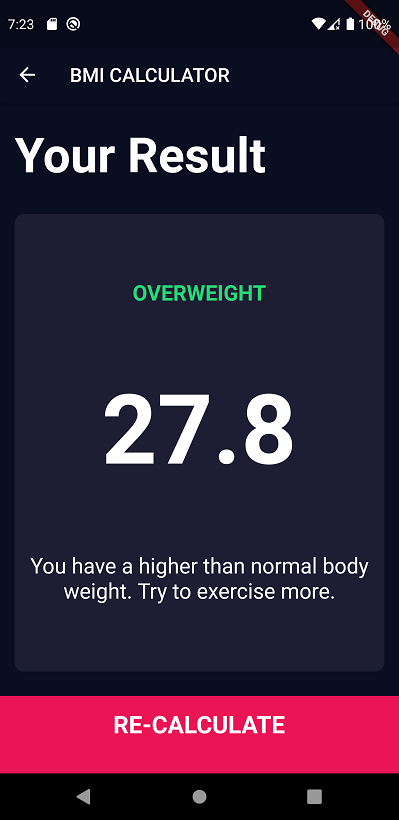

# BMI Calculator 💪

## Check whether you are normal, overweight and underweight.

### About the App

**A Flutter app to calculate BMI (Body Mass Index).**

The design reference of the App is taken from [Dribble](https://dribbble.com/).

### Usage
> ***To calculate BMI and for learning Purposes.***

